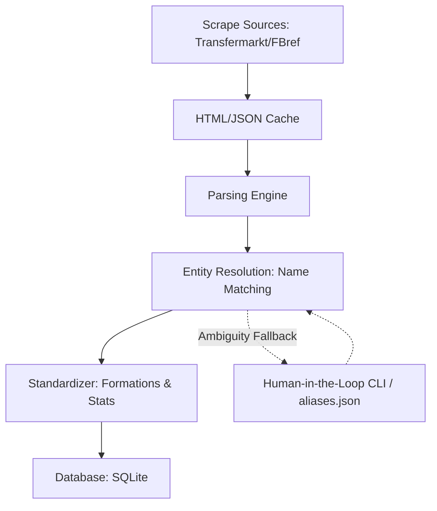
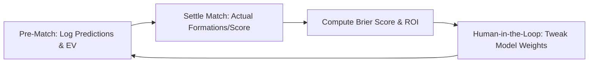

# Comprehensive Architecture Plan: Tactical Manager Sports Betting System

This document outlines the architecture for the dynamic sports betting system focused on managerial tactics, formation matchups, Expected Value (EV), and fractional Kelly Criterion.

---

## 1. The Data Pipeline Structure

To build a resilient backend, we will separate the extraction, cleaning, standardization, and matching phases.

### A. Scraper Engine (`scrapers.py`)
- **Sources**: Focus on manager stats (historical records, tenures, preferred structures) and team lineups/formations from FBref and Transfermarkt.
- **Resilience & Protection (IP Ban Prevention)**:
  - **Local Caching Layer**: All scraped pages will be stored locally as raw files (`data/cache/`) keyed by URL and date. If a URL has been fetched within the same game-week window, the system reads from disk. This completely eliminates redundant network traffic.
  - **Rate Limiting**: A randomized delay (e.g., $3.0$ to $7.0$ seconds) between requests.
  - **Request Headers**: Rotating list of common browser `User-Agent` strings.
  - **Graceful Failure**: If a page fails to load or blocks, the scraper falls back to cached data or raises a clean warning rather than crashing.

### B. Entity Resolution (`entity_resolution.py`)
- **Problem**: Matching manager names like "Josep Guardiola", "Pep Guardiola", and "J. Guardiola" across different sources.
- **Pipeline Strategy**:
  1. **Canonicalization**: Normalize strings (strip accents, convert to lowercase, remove punctuation, extract initials/surnames).
  2. **Strict Matching**: Check if the normalized strings match exactly.
  3. **Fuzzy Matching**: Apply Levenshtein Distance and Jaro-Winkler Similarity.
     - Similarity score $\ge 0.90$: Auto-resolve and map.
     - Similarity score between $0.70$ and $0.90$: Pause execution and prompt the user in the CLI to confirm mapping: *"Is 'J. Guardiola' the same as 'Pep Guardiola'? (y/n)"*.
     - Similarity score $< 0.70$: Log as unresolved and log a validation warning.
  4. **Persistence (`config/aliases.json`)**: Save approved mappings in a persistent configuration mapping file, ensuring the human-in-the-loop choice is only made once.

### C. Tactical Standardization (`processor.py`)
- **Formation Mapping**: Group minor tactical variations into standardized shapes.
  - Example: `4-2-3-1`, `4-2-3-1 deep`, and `4-1-4-1` can be mapped to tactical parents if specified, or tracked natively to see the effect of narrow/wide shapes.
- **Matchup Matrix**: Calculate historical metrics:
  - Manager win rate against specific opponent formations.
  - Team performance under the manager in home/away scenarios.

---

## 2. The Calculation Engine (`calculation_engine/`)

The engine computes betting opportunities by comparing our projected probabilities against implied market odds.

### A. Match Probability Model (`probability.py`)
Rather than relying solely on team strength, the model modifies a baseline probability using manager tactical data.

1. **Baseline Probability ($P_{\text{base}}$)**: Derived from league position, historical goal difference, or current team ELO ratings.
2. **Manager Form Modifier ($M_{\text{form}}$)**: Adjusts the baseline based on the manager's recent performance (e.g., last 5 games).
3. **Tactical Modifier ($T_{\text{matchup}}$)**:
   - **H2H Record**: Matchup record of Manager A vs Manager B.
   - **Formation Matchup**: Expected performance of Manager A's formation (e.g., `3-5-2`) against Manager B's formation (e.g., `4-3-3`), computed using historical league matchups.
4. **Combined Probability**:
   $$P_{\text{win}} = P_{\text{base}} \times M_{\text{form}} \times T_{\text{matchup}}$$
   The final probabilities for Win, Draw, and Loss are normalized to sum to $1.0$.

### B. Expected Value (EV) & Fractional Kelly Criterion (`kelly.py`)

- **Expected Value (EV)**:
  $$\text{EV} = (P_{\text{model}} \times \text{Decimal Odds}) - 1$$
  - If $\text{EV} > 0$, the bet represents positive value.
  - If $\text{EV} \le 0$, the bet is ignored.

- **Fractional Kelly Criterion**:
  Standard Kelly Criterion dictates:
  $$f^* = \frac{p(b + 1) - 1}{b}$$
  where:
  - $p$ = Model probability of outcome ($P_{\text{model}}$).
  - $b$ = Net odds ($\text{Decimal Odds} - 1$).
  
  To account for estimation error and reduce bankroll volatility, we apply a fractional multiplier $k$:
  $$f_{\text{bet}} = k \times f^*$$
  - **Recommended Default**: $k = 0.25$ (Quarter-Kelly) or $k = 0.125$ (Eighth-Kelly).
  - **Risk Constraints**: Max exposure limits (e.g., no single bet can exceed 5% of total bankroll).

---

## 3. The Feedback & Logging Loop (`feedback_loop/`)

To learn from feedback and refine calculations, we establish a structured log and evaluation system.

### A. Logging Mechanism (`logger.py`)
We will use a structured SQLite database (`data/tactics_betting.db`) to log every prediction before a match starts.

#### Pre-Match Log Fields:
- **Match Identifiers**: `match_id`, `date`, `home_team`, `away_team`, `home_manager`, `away_manager`.
- **Tactical Context**: `home_predicted_formation`, `away_predicted_formation`.
- **Model Inputs**: All component weightings used (H2H weights, formation weights).
- **Projections**: Projected $P_{\text{Win}}, P_{\text{Draw}}, P_{\text{Loss}}$.
- **Bet Details**: Implied odds, bookmaker decimal odds, calculated EV, suggested Kelly stake %, actual stake placed.

### B. Settlement & Calibration (`evaluator.py`)
After each matchday, the user runs the evaluator CLI to settle bets and review outcomes.

1. **Match Resolution**: Updates the table with `home_score`, `away_score`, `home_actual_formation`, and `away_actual_formation`.
2. **Financial Settling**: Calculates actual profit or loss, updating the bankroll.
3. **Performance Metrics**:
   - **Brier Score**: Evaluates model probability calibration:
     $$BS = \frac{1}{N} \sum_{t=1}^N (f_t - o_t)^2$$
     where $f_t$ is the forecast probability and $o_t$ is the actual outcome (1 or 0). Lower is better.
   - **Tactical Drift Audit**: Flags matches where managers changed their predicted formation, helping us identify whether tactical prediction models are leaking accuracy.
4. **Adjustment Mechanism**:
   - The user can adjust coefficients (e.g., increase weight on manager H2H vs general formation matchups).
   - The database persists the configurations, allowing historical comparisons of model versions.

---

## 4. Verification Plan

### Automated Verification
1. **Mock Scraper Tests**: Verify parsing pipelines process pages correctly without network requests using offline mock HTML.
2. **Formula Validation**: Assert standard math results for EV and fractional Kelly under extreme scenarios (e.g., $100\%$ certainty, near-zero edge odds, fractional scaling limits).
3. **Database Integrity**: Test prediction logs insert correctly and cascading updates occur when bet is settled.

### Manual Verification
- Execute a test run with mock fixture data (e.g., Chelsea vs Arsenal, Maresca vs Arteta).
- Log prediction, verify Kelly output, execute settlement, and confirm weight updates adjust prediction coefficients as designed.
